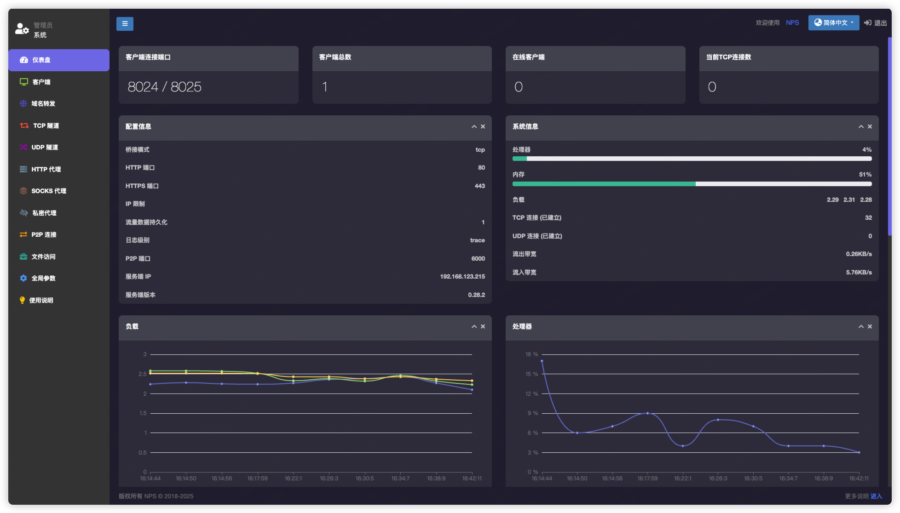

# NPS-Theme-Argon

> 申明：作者已重构更新主题了，直接使用新版即可
> 本仓库后续会基于新版做其他优化自用（比如登录页我还是喜欢透明框+背景图😂）

### 项目说明

- 本项目基于[NPS djylb二开版本](https://github.com/djylb/nps)制作的WebUI，原版NPS未适配测试
- 项目仅修改Web目录，未对nps功能进行改动
- 项目代码主要由AI生成，部分代码手动优化
- 身为产品经理，代码能力确实有限，代码质量不敢打包票 QAQ

### 更新说明

    v1.1 版本
    - 基于nps项目最新版本v0.33.12 重新构建主题，修复部分原版WebUI不兼容问题

### 项目特色

1. 登录页面基于OpenWrt Argon主题风格，支持暗色/浅色风格切换
2. 侧边栏菜单按钮的文字大小、字体均已优化
3. 菜单按钮图标美化处理，添加不同颜色风格
4. 仪表盘卡片样式重新构建，更简洁、清新
5. 去除列表中多余线条，表格整体展现更加清晰
6. 新增和编辑页面表单修改为暗色风格，并调整交互样式

### 界面展示

#### 1. 登录页（深色主题）

#### 2. 登录页（浅色主题）

### 3.仪表盘

#### 4. 列表

### 使用方法

- 未安装nps服务

  将项目代码克隆到本地或者服务器中，覆盖原本目录下的web目录，再执行`./nps install` 即可

- 已安装nps服务

  直接将web目录替换掉

### 感谢声明

由于原版的nps已经停止维护更新，再次感谢djylb二开继续维护更新，以下是二开版本项目地址：

[NPS 内网穿透 (全修)](https://github.com/djylb/nps)
